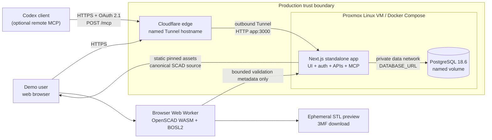
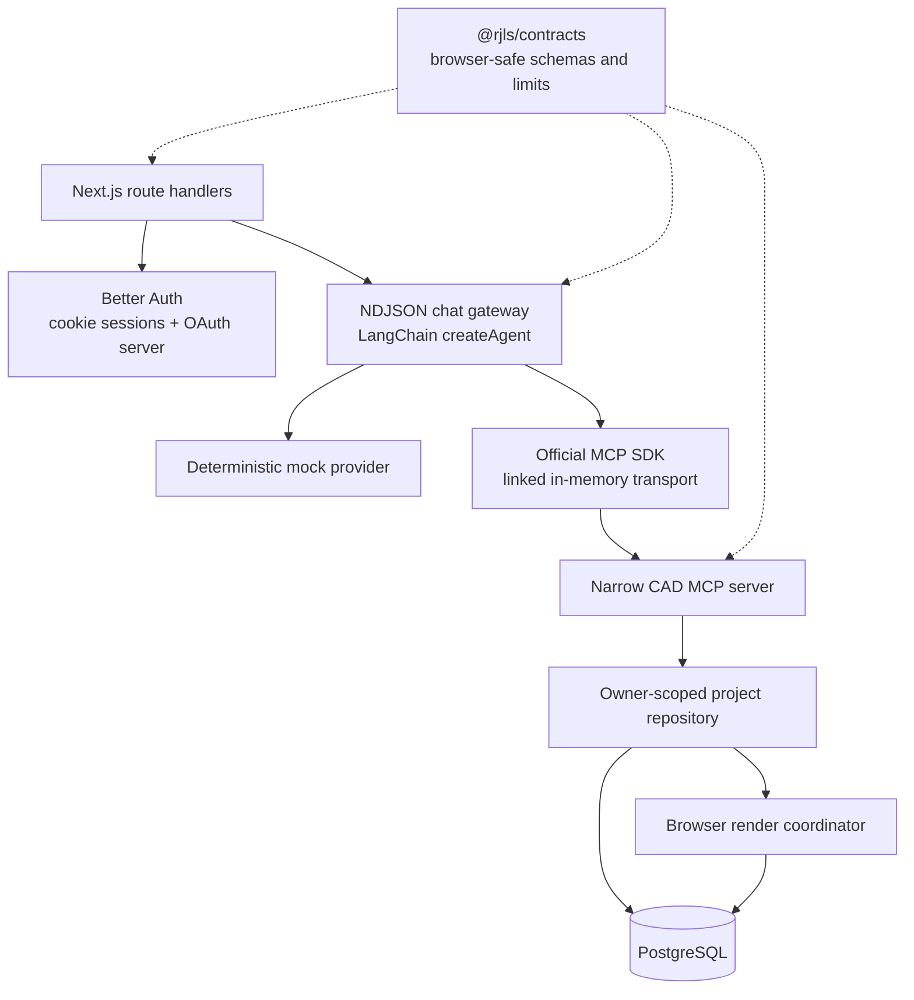
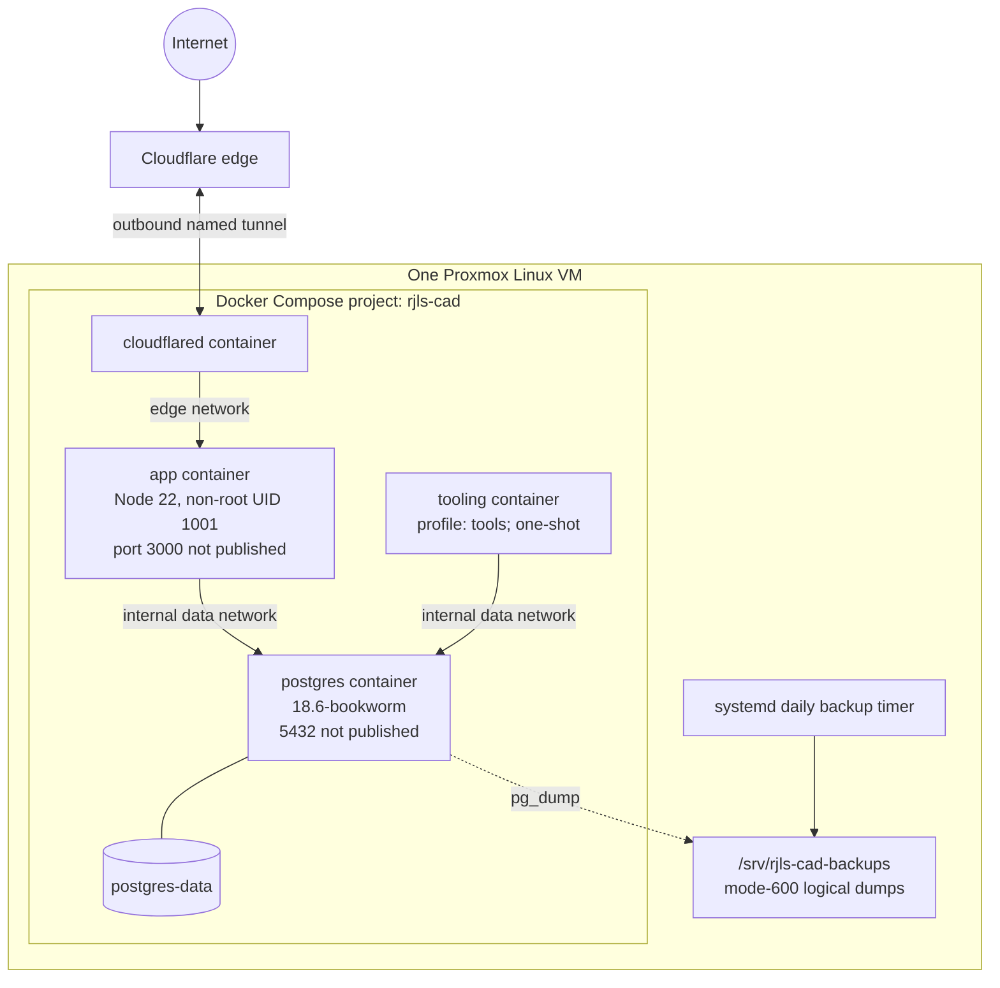
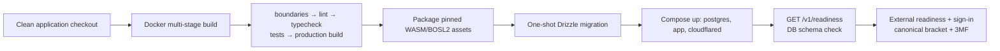

# Production infrastructure: 3D Model MCP demo

**As documented:** 2026-09-01  
**Application evidence:** `3d_model_mcp` commit `a271226f92536c76556d6f53cddd708559073081`  
**Deployment evidence:** sibling `px_3d_model_demo_deploy` commit `7501631231755d10935099c4a92f9f755d628e65`

## Scope and confidence

This document describes the production topology implemented by the application and its private deployment bundle. It is a configuration-backed architecture view, not a live-host audit: this workstation does not contain the production `proxmox/.env` and cannot prove the currently deployed commit, container health, public hostname, backup-timer status, or whether remote HTTP MCP is enabled. Those items are called out explicitly below.

The production demo is a single Linux VM on Proxmox. Docker Compose runs the Next.js application, PostgreSQL, and a named Cloudflare Tunnel. Neither the application nor PostgreSQL publishes a host port. OpenSCAD does not run on the VM: the browser downloads checksum-pinned OpenSCAD WASM and BOSL2 assets from the application and creates STL previews and 3MF downloads locally.

## System context



Key consequences:

- Cloudflare is the only public ingress. The tunnel is initiated outbound by `cloudflared`; the VM needs no inbound application forwarding.
- The Next.js process is the only long-running application service. There is no separate gateway, MCP server, renderer, queue, object store, Worker, or externally hosted database.
- PostgreSQL is reachable only by the app and one-shot tooling container on Compose's internal `data` network.
- Generated mesh bytes stay in browser memory or a browser download. PostgreSQL stores canonical OpenSCAD source, immutable revisions, users/sessions, OAuth state, and browser-render coordination records—not STL or 3MF blobs.
- Cloudflare Access is intentionally absent. The application owns authentication; public signup is disabled in the long-running container and users are provisioned through one-shot tooling.

## Runtime component architecture



The browser imports only the contracts package. Server-only model, repository, gateway, runtime, MCP, and renderer modules remain behind Next.js route handlers. Within the server, the combined runtime still performs official MCP initialization and tool-schema discovery over an in-memory SDK transport; it does not bypass the MCP boundary.

The production website provider is constrained by the deployment validator to `RJLS_CHAT_PROVIDER=mock`. It is deterministic and credential-free; no OpenAI or Anthropic API key is required or supported by the selected production profile.

## Website chat and revision flow

```mermaid
sequenceDiagram
    autonumber
    actor U as Signed-in browser
    participant API as POST /v1/chat
    participant G as Chat orchestrator
    participant M as CAD MCP tools
    participant P as PostgreSQL
    participant W as OpenSCAD Web Worker

    U->>API: v3 request + Origin + session ID
    API->>API: Authenticate cookie; validate origin, body, session
    API->>G: Start cancellable NDJSON stream
    G->>M: Create or edit candidate
    M->>P: Persist owner-scoped candidate
    G-->>U: candidate_created / render request
    U->>W: Render exact candidate source hash
    W-->>U: diagnostics + pinned provenance
    U->>API: source/session-bound completion
    API->>P: Validate and consume render job
    G->>M: Promote valid candidate
    M->>P: Lock parent and atomically publish revision
    G-->>U: candidate_promoted + current + done
```

The authoritative pointer is `projects.current_revision_id`. A candidate follows `CREATED → RUNNING → VALID → PROMOTED`. Promotion rechecks the parent while holding a PostgreSQL row lock and publishes the immutable revision and current pointer in one transaction. A rejected, malformed, cancelled, oversized, or stale candidate cannot replace the last-known-valid revision. Restore creates a new child revision rather than rewinding history.

Browser rendering uses a fresh Web Worker per job, a 60-second render limit, the Manifold backend, and build-time-pinned OpenSCAD/BOSL2 assets. The completion is accepted only when its user, project, candidate, browser session, one-time token hash, source hash, deadline, and renderer provenance match the persisted job.

## Optional remote Codex MCP flow

Remote MCP reuses the same Next.js container and PostgreSQL database. It exists only when `RJLS_REMOTE_MCP_ENABLED=1`; otherwise `/mcp` and the project render-claim route return 404. The deployment template defaults the flag to `0`, and its live value is not available in this checkout.

```mermaid
sequenceDiagram
    autonumber
    actor C as Codex
    actor B as Signed-in project tab
    participant CF as Cloudflare Tunnel
    participant A as Next.js / OAuth + MCP
    participant DB as PostgreSQL
    participant W as Browser WASM worker

    C->>CF: OAuth discovery and authorization
    CF->>A: Forward to same app
    A->>B: Login and consent UI
    A->>DB: Store grant; issue short-lived access token
    C->>CF: POST /mcp with Bearer token
    CF->>A: Streamable HTTP MCP request
    A->>DB: Verify token, scope cad:tools, grant, owner
    A->>DB: Create candidate and pending render job
    DB-->>A: Committed render-job notification
    A-->>B: SSE render-jobs-available
    B->>A: Atomic claim (cookie + origin + project + session)
    A-->>B: One-time token + exact SCAD source/hash
    B->>W: Render locally
    W-->>B: Diagnostics + provenance
    B->>A: Complete job
    A->>DB: Verify all bindings; mark valid/promote
    A-->>C: MCP tool result
```

The native OAuth client is public (`rjls-codex`) and uses exact loopback redirects, authorization code flow, and no client secret. Public dynamic registration is disabled. Access tokens last five minutes; refresh tokens last thirty days and are stored as one-way verifiers. Revoking a grant invalidates subsequent access and refresh attempts. Remote MCP has a 90-second server deadline; a browser has 15 seconds to claim a job and 60 seconds to render it. An absent browser fails closed and leaves the current revision unchanged.

Remote `export_model` returns source/export metadata. The actual 3MF file is still produced and downloaded from the website, never transferred through MCP to Codex.

## Deployment topology and isolation



| Component | Image/build | Persistence | Exposure |
| --- | --- | --- | --- |
| `app` | Multi-stage Node 22 standalone Next.js image; runs as non-root `nextjs` | Stateless | Only `cloudflared` on private `edge` network |
| `postgres` | `postgres:18.6-bookworm` | `postgres-data` named volume | `app` and tooling on internal `data` network |
| `cloudflared` | Configurable, default `cloudflare/cloudflared:latest` | Tunnel configuration lives at Cloudflare; token in mode-600 deployment env | Outbound tunnel connection |
| `tooling` | Same verified source build, production tooling target | One-shot migration/user/OAuth operations | No public exposure |
| browser renderer | Static OpenSCAD WASM/BOSL2 assets executed by visitor | Ephemeral mesh/output | Browser sandbox only |

The VM sizing recommendation is 2 vCPU, 4 GB RAM, and 25 GB disk on Debian 12 or Ubuntu 24.04. That is a deployment baseline, not an autoscaling policy. This demo has one app replica and one database instance; there is no load balancer behind the tunnel and no automatic failover.

## Build, release, health, and rollback



- PostgreSQL must be healthy before tooling or app startup. The app is healthy only when `GET /v1/readiness` succeeds; the readiness path verifies that the expected database schema exists.
- The deploy script validates environment policy, pulls the PostgreSQL and tunnel images, builds locally, runs migrations, and waits for Compose health.
- Schema changes must remain backward-compatible during the short migration-before-replacement window.
- Code rollback means selecting the previous compatible application commit and redeploying. Database files are not rolled back by replacing the volume; data restore uses a tested logical backup.
- The supplied systemd timer runs a daily custom-format `pg_dump`, validates its catalog with `pg_restore --list`, and deletes matching archives older than the configured retention (default seven days). The runbook also requires off-VM Proxmox backups and periodic full restore drills.

## Security and trust boundaries

- Better Auth cookie sessions establish website identity. Server-derived user IDs scope every repository and render-job path; project IDs, job IDs, and browser session IDs are not authority by themselves.
- State-changing browser routes require an exact allowed `Origin`; chat also binds the request to the browser session header.
- Production signup is disabled. Provisioning temporarily enables it only in an isolated one-shot tooling container.
- Database credentials, the Better Auth secret, and tunnel token live in an operator-owned mode-600 environment file and are injected at runtime. They are not baked into the image or Codex configuration.
- The stable Better Auth secret protects encrypted OAuth signing keys. Reusable access/refresh verifiers are not stored in plaintext.
- The MCP tool surface is narrow and schema-validated. There are no generic shell or filesystem tools, arbitrary imports, or server-side OpenSCAD execution.
- Candidate promotion is the commit boundary. Browser rendering is validation evidence bound to exact source and pinned provenance; it is not an engineering or manufacturing safety attestation.

## Operational unknowns requiring a live-host check

These cannot be established from the checked-out repositories:

1. Public hostname and Cloudflare tunnel health.
2. Exact application and deployment commits running on the VM.
3. Current values of `RJLS_REMOTE_MCP_ENABLED`, database pool size, and image digests.
4. Compose container health/restart counts and current database/volume utilization.
5. Whether exactly one backup timer is active, when the last verified dump completed, and whether an off-VM restore drill has succeeded.
6. Whether OAuth client callbacks and user grants match current Codex installations.

A production audit should capture `docker compose ps`, sanitized resolved Compose configuration, app/tunnel/database logs, deployed Git SHAs or immutable image digests, readiness responses from outside the LAN, systemd timer status, and the latest restore-drill evidence.

## Source map

Application sources:

- [`README.md`](../README.md) — runtime profiles, remote MCP behavior, deadlines, token lifetimes, and deployment boundary.
- [`docs/architecture.md`](architecture.md) — trust path, revision invariant, renderer model, and persistence semantics.
- [`packages/runtime/src/configured-runtime.ts`](../packages/runtime/src/configured-runtime.ts) — per-owner combined runtime, in-memory MCP client, repository, and readiness.
- [`packages/runtime/src/remote-mcp-http.ts`](../packages/runtime/src/remote-mcp-http.ts) — authenticated Streamable HTTP MCP endpoint and 90-second deadline.
- [`packages/runtime/src/remote-browser-renderer.ts`](../packages/runtime/src/remote-browser-renderer.ts) — database-backed remote render handoff.
- [`apps/site/src/lib/openscad.worker.ts`](../apps/site/src/lib/openscad.worker.ts) — checksum-verified browser assets and Web Worker execution.
- [`apps/site/src/app/v1/browser-renders/[jobId]/route.ts`](../apps/site/src/app/v1/browser-renders/%5BjobId%5D/route.ts) — authenticated, session-bound completion endpoint.

Deployment sources (sibling private bundle):

- [`compose.yaml`](../../px_3d_model_demo_deploy/compose.yaml) — services, networks, health checks, volumes, and runtime environment.
- [`Dockerfile`](../../px_3d_model_demo_deploy/Dockerfile) — verified multi-stage build and non-root standalone runtime.
- [`docs/proxmox-deployment.md`](../../px_3d_model_demo_deploy/docs/proxmox-deployment.md) — VM, tunnel, release, rollback, backup, and remote MCP runbook.
- [`scripts/deploy-home.sh`](../../px_3d_model_demo_deploy/scripts/deploy-home.sh) — migration and deployment sequence.
- [`scripts/backup-postgres.sh`](../../px_3d_model_demo_deploy/scripts/backup-postgres.sh) — logical backup verification and retention.

## Live update protocol

See [Project live updates](project-live-updates.md) for trigger-based SSE, reconnect behavior, render coordination, and rollout requirements.
